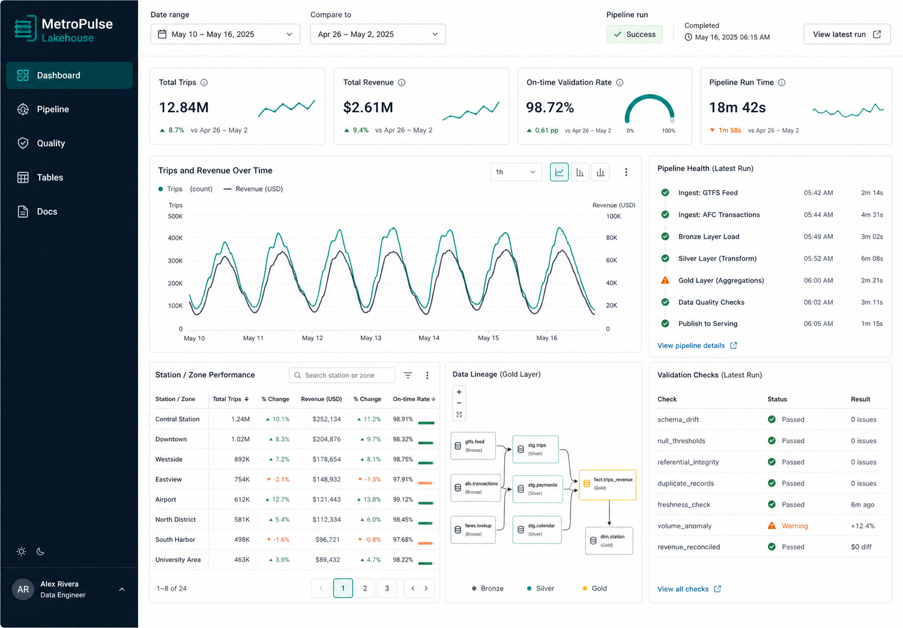
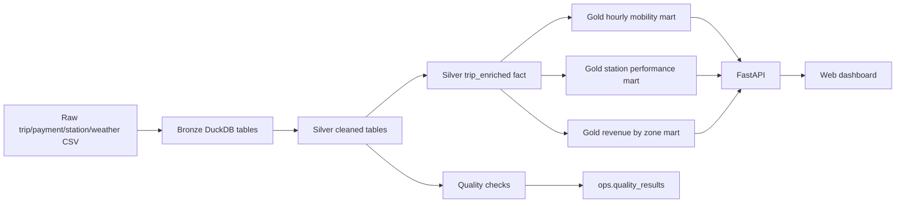

# MetroPulse Lakehouse

MetroPulse Lakehouse is an end-to-end data engineering portfolio project for an urban mobility operator. It generates realistic raw trip, payment, station, and weather feeds; loads them into a DuckDB warehouse; builds bronze, silver, and gold data layers; persists pipeline metadata and quality checks; serves analytics through FastAPI; and visualizes the final marts in a dependency-free web dashboard.

This project is designed to be easy to run locally and easy to explain in a Data Engineer interview.



## What It Demonstrates

- Batch ingestion from raw CSV feeds with source-file lineage
- Warehouse modeling with bronze, silver, and gold layers in DuckDB
- SQL transformations for cleaned entities, enriched facts, and analytics marts
- Data quality gates for row counts, duplicates, timestamp validity, joins, freshness, and dashboard readiness
- Orchestration through a CLI with persistent run metadata
- FastAPI service over analytics-ready tables
- Dependency-free web dashboard consuming the API
- Automated tests for the pipeline and API
- CI workflow that reruns the local verification path
- Clear architecture and interview notes

## Architecture



## Quick Start

Requirements:

- Python 3.11+
- Node.js 18+

```bash
python -m venv .venv
source .venv/bin/activate
python -m pip install -e ".[dev]"
metropulse run --days 45 --seed 20260611
pytest -q
cd apps/dashboard && npm run build && cd ../..
```

npm is only used to run the dependency-free dashboard scripts; there are no frontend packages to install.

Start the API:

```bash
metropulse serve-api --host 127.0.0.1 --port 8000
```

Start the dashboard in another terminal:

```bash
cd apps/dashboard
npm run dev
```

Open `http://127.0.0.1:5173`.

## Useful Commands

```bash
make setup      # install Python dependencies and build the dashboard
make pipeline   # generate raw data and rebuild the warehouse
make test       # run Python tests
make lint       # run Python lint checks
make verify     # run pipeline, tests, lint, and dashboard build
make api        # serve FastAPI
make dashboard  # serve the local dashboard
```

For the same verification path used by CI:

```bash
bash scripts/verify.sh
```

## Repository Layout

```text
.
├── apps/dashboard/       # Dependency-free HTML/CSS/JS dashboard
├── data/raw/             # Generated source files
├── data/warehouse/       # DuckDB warehouse file
├── docs/                 # Architecture and interview notes
├── scripts/              # Local verification helpers
├── src/metropulse/       # Pipeline, transformations, API, CLI
└── tests/                # Pipeline and API tests
```

## Warehouse Layers

- `bronze.*`: Raw CSV loads with `loaded_at` and `source_file`
- `silver.stations`: Typed station dimension
- `silver.weather_hourly`: Typed hourly weather observations
- `silver.trips`: Cleaned trip events
- `silver.payments`: Cleaned payment records
- `silver.trip_enriched`: Joined analytical fact table
- `gold.hourly_mobility`: Hourly trips and revenue by zone and rider type
- `gold.daily_station_performance`: Station-level daily performance
- `gold.revenue_by_zone`: Revenue and trip metrics by zone
- `gold.dashboard_summary`: Single-row dashboard KPI table
- `ops.pipeline_runs`: Pipeline run history
- `ops.quality_results`: Quality results per run

## Quality Gates

The pipeline fails when required quality checks fail. Current checks cover:

- Raw trip feed loaded
- Silver trip table loaded
- Duplicate trip IDs
- Invalid timestamps
- Payment join rate
- Missing station references
- Dashboard summary readiness
- Latest-trip freshness

## Why This Is Strong For Data Engineer Roles

This project shows more than a notebook. It has an interview-friendly production shape: repeatable ingestion, warehouse layers, SQL transformations, observability tables, quality gates, an API contract, a dashboard, tests, and docs. It also stays small enough to run on a laptop, which makes it easy to demo live during interviews.

Good talking points:

- How bronze/silver/gold layers separate raw history, cleaned entities, and business marts
- Why quality checks are stored as data, not just printed to logs
- How deterministic source generation supports reliable local testing
- How FastAPI decouples the dashboard from warehouse internals
- How CI proves the project still works after changes
- How you would evolve this into Airflow/Dagster, object storage, dbt, and a cloud warehouse

See [docs/portfolio-case-study.md](docs/portfolio-case-study.md) for a concise case-study version you can reuse in a portfolio page.

## Dashboard

The dashboard reads from FastAPI endpoints backed by DuckDB gold marts. After running the API and dashboard server, it shows:

- KPI cards for trips, revenue, validation rate, and latest runtime
- Trips and revenue time series
- Latest pipeline run timeline
- Quality check results
- Station performance table
- Revenue by zone
- Data lineage from raw files to dashboard

An implementation screenshot can be generated with the verification workflow and saved as `docs/dashboard-screenshot.png`.
