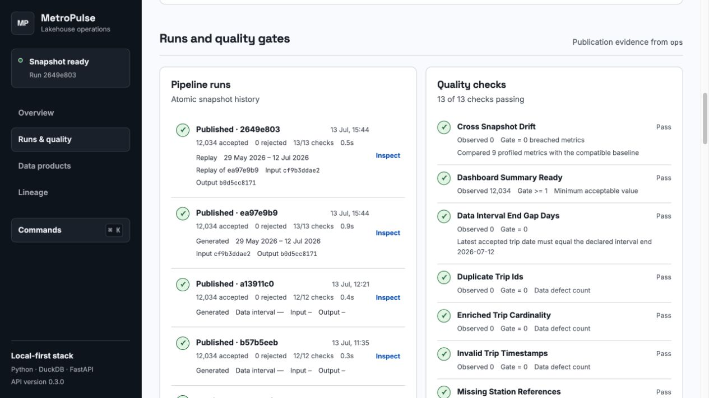

# MetroPulse Lakehouse

[](https://github.com/Yurii201811/metropulse-lakehouse/actions/workflows/ci.yml)
[](https://www.python.org/)
[](LICENSE)

MetroPulse is a compact, production-shaped data platform for an urban mobility operator. It generates or replays deterministic trip, payment, station, and weather snapshots; records file- and relation-level fingerprints; builds bronze, silver, and gold models in DuckDB; detects cross-snapshot drift; enforces row-level contracts and publication gates; exposes the evidence through FastAPI; and renders it in a dependency-free operations console.



## What makes it production-shaped

- **Non-blocking atomic publication:** each run builds a copy-on-write DuckDB candidate under a single-publisher lock, commits internally, then atomically swaps the file. API readers stay on the previous file until that swap.
- **Explicit contracts:** invalid trips and payments receive a rejection reason instead of disappearing during a filter.
- **Verifiable inputs:** generated runs write to `data/raw/runs/<run_id>/`; every generated or replayed run records path, SHA-256, byte size, and row count in `ops.ingest_files`.
- **Replayable snapshots:** `--as-of` fixes the data interval, while `metropulse replay` verifies the original four-file manifest, stages private copies, and requires exact input and output fingerprints before publishing the rebuilt `snapshot-v1` contract.
- **Drift-aware publication:** 12 dataset profiles feed nine thresholded comparisons; six business-column relation fingerprints and input/output SHA-256 values make replay equivalence inspectable.
- **Cardinality protection:** duplicate trip payments are quarantined before the fact join, preventing revenue and row multiplication.
- **Operational API:** separate liveness and readiness endpoints, bounded parameters, typed filters, snapshot metadata, and safe 503 responses.
- **Resilient console:** filters, truthful hourly axes, accessible data tables, actual lineage edges, a command menu, responsive station cards, and partial-failure recovery.
- **Repeatable verification:** 35 Python tests, 17 frontend/server tests, Ruff, an isolated 45-day pipeline run, and Python 3.11–3.14 CI coverage.
- **Release contract:** package, API, dashboard, and changelog versions stay aligned; CI builds and checks the wheel/sdist, installs the wheel cleanly, and runs a fixed-date pipeline smoke test.

## Architecture

```mermaid
flowchart LR
  MODE["Generate with --as-of or replay --run-id"] --> RAW["Run-scoped CSV sources"]
  RAW --> MANIFEST["Four-file SHA-256 manifest"]
  RAW --> CANDIDATE["Copy-on-write DuckDB candidate"]
  CANDIDATE --> BRONZE["Bronze source-shaped tables"]
  BRONZE --> CONTRACTS["Trip and payment contracts"]
  CONTRACTS --> REJECTS["Typed rejection tables"]
  CONTRACTS --> SILVER["Silver accepted and enriched facts"]
  SILVER --> GOLD["Gold analytics marts"]
  GOLD --> PROFILE["12 profiles + 6 relation fingerprints"]
  PROFILE --> DRIFT["9 thresholded drift comparisons"]
  DRIFT --> QUALITY["13 publication checks"]
  QUALITY -->|"pass"| COMMIT["Commit candidate transaction"]
  QUALITY -->|"fail"| ROLLBACK["Rollback candidate snapshot"]
  COMMIT --> SWAP["Atomic published-file swap"]
  ROLLBACK --> SWAP
  SWAP --> API["FastAPI"]
  API --> UI["Operations console"]
  MANIFEST --> OPS["Ops evidence"]
  ROLLBACK --> OPS
```



The generated source files live outside the DuckDB transaction so failed-run evidence remains inspectable. Warehouse work happens in a separate candidate file. After success, or after rollback plus failed-run evidence persistence, one atomic file replacement publishes the new state; short-lived API readers continue opening the prior file until that replacement.

## Quick start

Requirements:

- macOS or Linux (publication uses POSIX file-lock and atomic-rename semantics)
- Python 3.11–3.14
- Node.js 24 LTS

```bash
python3 -m venv .venv
source .venv/bin/activate
python -m pip install -e ".[dev]"
metropulse run --days 45 --seed 20260611 --as-of 2026-07-12
metropulse status
npm --prefix apps/dashboard run build
```

Start the two local services in separate terminals:

```bash
metropulse serve-api --host 127.0.0.1 --port 8000
```

```bash
npm --prefix apps/dashboard run dev
```

Open [http://127.0.0.1:5173](http://127.0.0.1:5173). API documentation is available at [http://127.0.0.1:8000/docs](http://127.0.0.1:8000/docs).

The dashboard has no runtime packages or bundler. Node runs the build, tests, and local static server.

## Reference run

The 45-day run verified on **2026-07-13** with seed `20260611` produced:

| Evidence | Result |
| --- | ---: |
| Accepted trips | 12,034 |
| Matched revenue | $64,194.47 |
| Active stations | 28 |
| Weather hours | 1,080 |
| Gold hourly rows | 7,731 |
| Source manifests | 4 |
| Quality checks | 13 / 13 passing |
| Trip / payment rejects | 0 / 0 |

This reference window is pinned with `--as-of 2026-07-12`. The same days, seed, and inclusive end date reproduce the same source hashes even when the command is executed later.

## Commands

```bash
make setup      # install the editable package and build the dashboard
make pipeline   # publish a deterministic 45-day snapshot
make status     # show the latest run and source hashes
make test       # run Python tests
make lint       # run Ruff
make verify     # isolated pipeline + CLI + Python + frontend verification
make api        # serve FastAPI on 127.0.0.1:8000
make dashboard  # build and serve the console on 127.0.0.1:5173
```

`bash scripts/verify.sh` uses a temporary project root by default, so verification does not overwrite your working warehouse. Set `METROPULSE_VERIFY_ROOT` to preserve its generated evidence.

For an explicitly dated snapshot and a verified replay:

```bash
metropulse run --days 45 --seed 20260611 --as-of 2026-07-12
metropulse replay --run-id RUN_ID
```

`--as-of` is the inclusive data-interval end and cannot be later than yesterday. Replay accepts the source run ID only; it inherits that run's days, seed, interval, and `snapshot-v1` contract.

## Data model

| Layer | Main relations | Responsibility |
| --- | --- | --- |
| Bronze | `bronze.trips`, `payments`, `stations`, `weather` | Source-shaped CSV loads plus `loaded_at`, `source_file`, and `source_run_id` |
| Silver | `silver.trips`, `payments`, `stations`, `weather_hourly`, `trip_enriched` | Typed accepted records and analytical joins |
| Rejections | `silver.trip_rejections`, `payment_rejections` | Contract failures with explicit rejection reasons |
| Gold | `hourly_mobility`, `daily_station_performance`, `revenue_by_zone`, `dashboard_summary`, `lineage_edges` | Consumer-shaped aggregates and lineage |
| Ops | `pipeline_runs`, `quality_results`, `ingest_files`, `dataset_profiles`, `relation_fingerprints`, `drift_results` | Run identity, publication gates, source/output evidence, profiles, and drift comparisons |

The complete contracts and rejection reasons are documented in [docs/data-contracts.md](docs/data-contracts.md).

## API surface

| Endpoint | Purpose |
| --- | --- |
| `GET /health` | Process liveness; does not expose local filesystem paths |
| `GET /ready` | Published-warehouse readiness and missing-table diagnostics |
| `GET /api/summary` | Filtered KPIs plus snapshot and rejection metadata |
| `GET /api/timeseries` | Filtered hourly trips and revenue |
| `GET /api/stations`, `/api/zones` | Filtered station and zone aggregates |
| `GET /api/filters` | Available date, zone, and rider dimensions |
| `GET /api/pipeline-runs`, `/api/pipeline-runs/{run_id}` | Run history and one-run investigation bundle |
| `GET /api/quality`, `/api/ingest-files` | Current or historical gate and source-manifest evidence via `run_id` |
| `GET /api/drift` | Current or historical profile-drift comparison via `run_id` |
| `GET /api/lineage` | Source-to-target edges |

Analytics endpoints accept `start_date`, `end_date`, `zone_id`, and `rider_type`. Station results additionally enforce `1 <= limit <= 50`.

The run-detail response groups metadata, quality outcomes, manifests, 12 profiles, six relation fingerprints, and drift results for one investigation. The console exposes the same evidence through its drift and run-investigation views.

## Configuration

Copy `.env.example` if you want a shell environment file, then load it explicitly:

```bash
cp .env.example .env
set -a; source .env; set +a
```

- `METROPULSE_PROJECT_ROOT` controls the data root.
- `METROPULSE_DB_PATH` overrides the DuckDB path.
- `METROPULSE_API_BASE_URL` is embedded in `dist/config.js` by the dashboard build.
- `METROPULSE_CORS_ORIGINS` is a comma-separated list of exact dashboard origins allowed by the API; paths, credentials, queries, and fragments are rejected.

The application intentionally does not parse `.env` files automatically.

## Repository layout

```text
.
├── .github/               # CI and dependency-update policy
├── apps/dashboard/        # HTML, token-driven CSS, ES modules, tests, local server
├── data/raw/runs/         # Generated run-scoped source files (ignored)
├── data/warehouse/        # Generated DuckDB snapshot (ignored)
├── docs/                  # Architecture, contracts, screenshots, interview material
├── scripts/verify.sh      # Isolated end-to-end verifier
├── src/metropulse/        # Generator, ingestion, SQL models, quality, API, CLI
├── tests/                 # Pipeline, replay, rollback, drift, quality, and API tests
└── tokens.css             # Hallmark Cobalt design tokens
```

## Further reading

- [Architecture and failure semantics](docs/architecture.md)
- [Data contracts](docs/data-contracts.md)
- [Portfolio case study](docs/portfolio-case-study.md)
- [Interview guide](docs/interview-guide.md)
- [Mobile console screenshot](docs/dashboard-mobile-screenshot.png)
- [Original dashboard concept](docs/dashboard-concept.png)

## License

[MIT](LICENSE) © Yurii Bakurov

## Current scope

MetroPulse 0.3.0 remains a synthetic, full-refresh local demonstration. It uses one DuckDB file, illustrative drift thresholds, and same-contract (`snapshot-v1`) replay. It does not yet provide incremental ingestion, a scheduler, containers, cloud storage or compute, authentication, or alert delivery.
