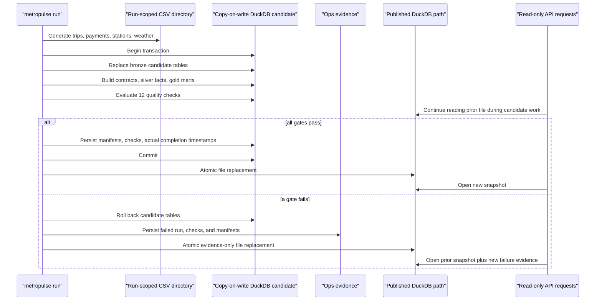

# Architecture

## Design goal

MetroPulse is intentionally local and compact, but its boundaries mirror a larger analytical platform: immutable run inputs, source-shaped landing tables, explicit contracts, consumer-oriented marts, publication gates, an operational API, and a UI that can degrade by data product instead of failing as one page.

## Run lifecycle

Raw generation precedes the database transaction, and each run receives a unique `data/raw/runs/<run_id>/` directory. A non-blocking publisher lock permits one candidate at a time. The candidate starts as a copy of the published database (or a new database for the first run), so failed inputs remain inspectable and a failed candidate cannot replace source bytes referenced by an earlier manifest.

## Warehouse responsibilities

### Bronze

Bronze tables mirror each CSV and add `loaded_at`, `source_file`, and `source_run_id`. They are replaced only inside the candidate transaction.

### Silver and contracts

Trip and payment fields use safe casts. Invalid rows receive explicit reasons in `silver.trip_rejections` or `silver.payment_rejections`; accepted rows proceed to `silver.trips` and `silver.payments`. Duplicate payments are removed from the accepted set before `silver.trip_enriched` is built, preserving fact cardinality.

Station and weather dimensions are typed separately. The enriched fact joins start/end stations, one accepted payment, and hourly weather. Cardinality, payment coverage, missing dimensions, and amount reconciliation are publication gates.

### Gold

- `gold.hourly_mobility`: hour × start zone × rider aggregates
- `gold.daily_station_performance`: daily station departures, revenue, and member share
- `gold.revenue_by_zone`: zone revenue and trip economics
- `gold.dashboard_summary`: current snapshot KPIs and published rejection counts
- `gold.lineage_edges`: source, target, and transform relationships rendered by the console

### Ops

- `ops.pipeline_runs`: lifecycle status, counts, errors, and `published_at`
- `ops.quality_results`: observed values and thresholds for every evaluated gate
- `ops.ingest_files`: run-scoped path, SHA-256, bytes, rows, and load time

## Read consistency

FastAPI opens short-lived read-only DuckDB connections to the published path, while the pipeline writes only its isolated candidate file. The closed candidate is atomically renamed onto the published path after it is complete, so an API request sees either the prior file or the complete replacement without contending with the writer. `/health` reports process liveness; `/ready` separately confirms that required relations and a published run exist.

Analytics filters are applied to `silver.trip_enriched`, not to cached dashboard JSON. Summary, time series, stations, and zones therefore share the same date/zone/rider predicate. Operational endpoints deliberately remain unfiltered.

## Console behavior

The browser requests data products independently. A failure in one endpoint replaces only that panel and raises one concise partial-data notice; successful operational sections remain available. A retry re-requests the failed state without requiring a page reload.

Trips and revenue use aligned hourly domains but separate labeled scales. The console renders every returned hour, exposes the same values as a table, renders actual lineage edges and transform types, and changes station tables into labeled records at phone widths.

## Tool choices

- **DuckDB:** transactional analytical SQL without cloud credentials
- **Python + Typer:** readable orchestration and a demo-friendly CLI
- **SQL:** visible contract, dimensional, fact, and aggregate logic
- **FastAPI:** typed query validation, OpenAPI, liveness, and readiness
- **HTML/CSS/ES modules:** a transparent UI with no package runtime or bundler
- **Pytest + Node test runner + Ruff:** deterministic data, API, UI-core, and static-server verification

## Production evolution

The boundaries map directly to a larger deployment:

| Local component | Production analogue |
| --- | --- |
| Run-scoped CSV directory | Versioned S3/GCS landing prefix |
| Copy-on-write DuckDB plus file swap | Warehouse staging schema plus atomic swap |
| Python CLI | Dagster, Airflow, or Prefect asset graph |
| SQL functions | dbt models and tests |
| In-process gates | dbt, Soda, or Great Expectations policy |
| `ops` tables | Orchestrator metadata and observability warehouse |
| FastAPI | Versioned data-product or semantic API |
| Local console | Authenticated deployed operations UI |

See [data-contracts.md](data-contracts.md) for row rules, rejection reasons, and thresholds.
